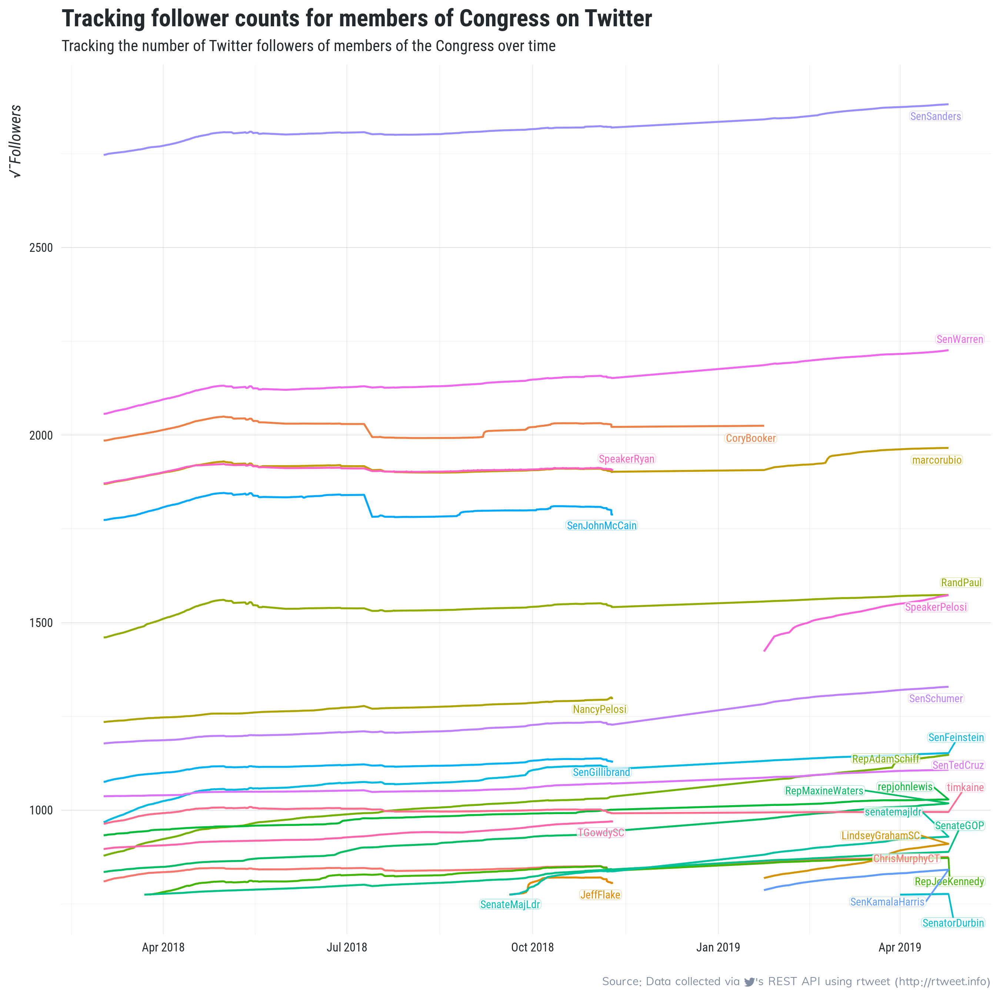
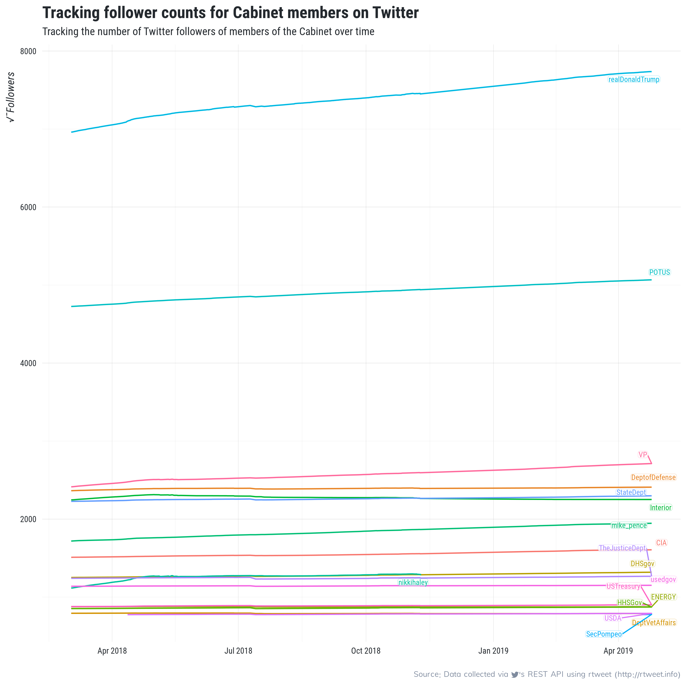
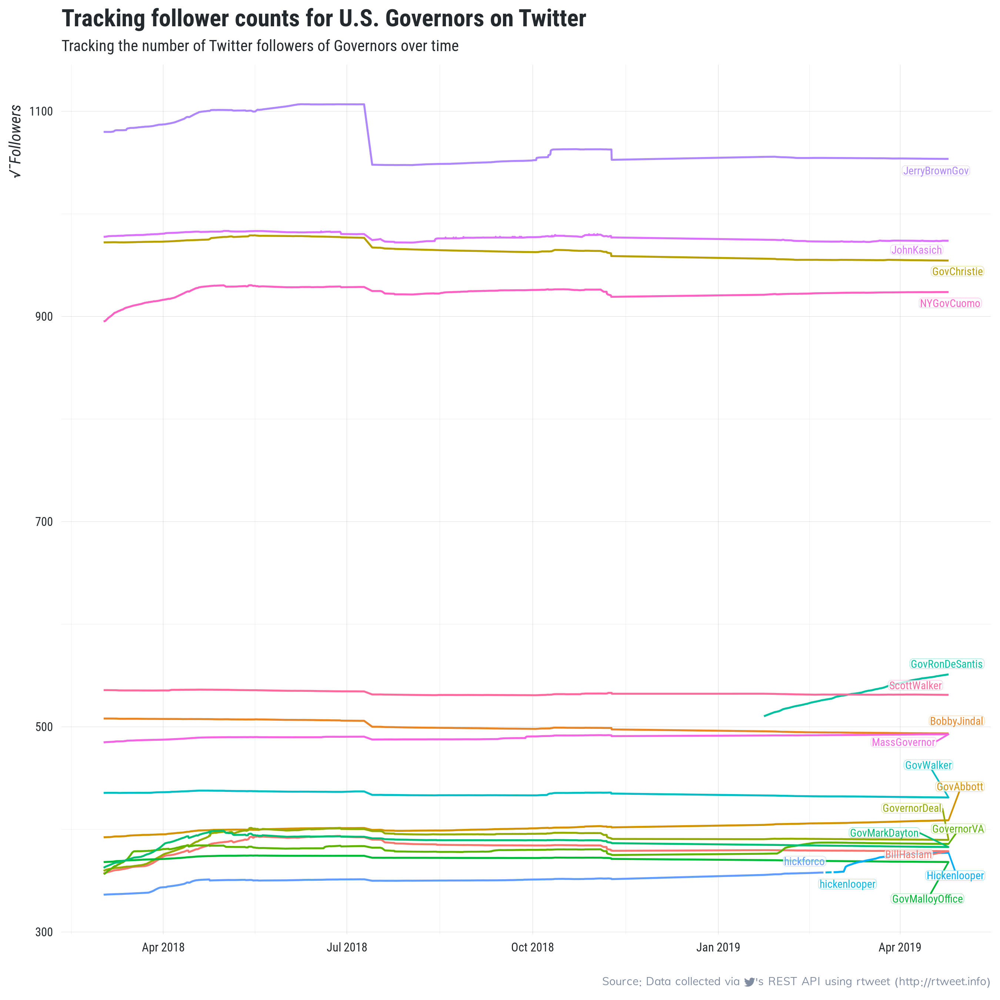

cspan\_data
-----------

Tracking users-level data of (a) [Members of Congress](https://twitter.com/cspan/lists/members-of-congress), (b) [The Cabinet](https://twitter.com/cspan/lists/the-cabinet/), and (c) [Governors](https://twitter.com/cspan/lists/governors) using CSPAN Twitter lists and the [rtweet package](http://rtweet.info).

\#dataviz
---------

### Members of Congress

<p align="center">

</p>
 

### The Cabinet

<p align="center">

</p>
 

### Governors

<p align="center">

</p>
 

Data collection script
----------------------

Data collected using [rtweet](http://rtweet.info)

``` r
## load rtweet and tidyverse
library(rtweet)

## define function for getting CSPAN Twitter lists data
get_cspan_list <- function(slug) {
  ## get users data of list members
  x <- lists_members(slug = slug, owner_user = "CSPAN")
  ## document slug
  x$cspan_list <- slug
  ## timestamp observations
  x$timestamp <- Sys.time()
  ## return data
  x
}

## cspan lists
cspan_lists <- c("members-of-congress", "the-cabinet", "governors")

## members of congress
cspan_data <- purrr::map(cspan_lists, get_cspan_list)

## merge into single data frame
cspan_data <- dplyr::bind_rows(cspan_data)
```

Data visualization script
-------------------------

Plots created using [ggplot2](http://ggplot2.org/) and [ggrepel](https://github.com/slowkow/ggrepel)

``` r
## load tidyverse
suppressPackageStartupMessages(library(tidyverse))

## read all files
data_files <- list.files("data", full.names = TRUE)
cspan_data <- map(data_files, readRDS)

## merge into single data set
cspan_data <- bind_rows(cspan_data)

## shortcuts for subsetting into data sets
congress_data <- function(cspan_data) filter(
  cspan_data, cspan_list == "members-of-congress")
cabinet_data <- function(cspan_data) filter(
  cspan_data, cspan_list == "the-cabinet")
governors_data <- function(cspan_data) filter(
  cspan_data, cspan_list == "governors")

## plot most popular congress accounts
library(ggrepel)

## hacky function for labels
timestamp_range <- function(timestamp) {
  n <- length(unique(timestamp))
  x <- seq(min(timestamp), max(timestamp), length.out = (length(timestamp) / n))
  nas <- rep(as.POSIXct(NA_character_), length(x))
  c(x, rep(nas, n - 1L))
}

## member of congress
cspan_data %>%
  filter(followers_count > 3e5) %>%
  congress_data() %>%
  mutate(followers_count = log10(followers_count)) %>%
  arrange(timestamp) %>%
  mutate(x = timestamp_range(timestamp)) %>%
  group_by(screen_name) %>%
  mutate(mean = mean(followers_count)) %>%
  ungroup() %>%
  ggplot(aes(x = timestamp, y = followers_count, colour = screen_name, label = screen_name)) +
  theme_mwk(base_family = "Roboto Condensed") +
  theme(legend.position = "none") +
  geom_line() +
  geom_point() +
  geom_label_repel(aes(x = x, y = mean), family = "Roboto Condensed") +
  labs(title = "Tracking follower counts for members of Congress on Twitter",
    subtitle = "Tracking the number of Twitter followers of members of the Congress over time",
    x = NULL, y = "Number of followers (logged)",
    caption = "\nSource: Data collected via Twitter's REST API using rtweet (http://rtweet.info") +
  ggsave("plots/members-of-congress.png", width = 7, height = 9, units = "in")

## cabinet members
cspan_data %>%
  cabinet_data() %>%
  mutate(followers_count = log10(followers_count)) %>%
  arrange(timestamp) %>%
  mutate(x = timestamp_range(timestamp)) %>%
  group_by(screen_name) %>%
  mutate(mean = mean(followers_count)) %>%
  ungroup() %>%
  ggplot(aes(x = timestamp, y = followers_count, colour = screen_name, label = screen_name)) +
  theme_mwk(base_family = "Roboto Condensed") +
  theme(legend.position = "none") +
  geom_line() +
  geom_point() +
  geom_label_repel(aes(x = x, y = mean), family = "Roboto Condensed") +
  labs(title = "Tracking follower counts for Cabinet members on Twitter",
    subtitle = "Tracking the number of Twitter followers of members of the Cabinet over time",
    x = NULL, y = "Number of followers (logged)",
    caption = "\nSource: Data collected via Twitter's REST API using rtweet (http://rtweet.info") +
  ggsave("plots/the-cabinet.png", width = 7, height = 7, units = "in")

## governors
cspan_data %>%
  governors_data() %>%
  mutate(followers_count = log10(followers_count)) %>%
  arrange(timestamp) %>%
  mutate(x = timestamp_range(timestamp)) %>%
  group_by(screen_name) %>%
  mutate(mean = mean(followers_count)) %>%
  ungroup() %>%
  ggplot(aes(x = timestamp, y = followers_count, colour = screen_name, label = screen_name)) +
  theme_mwk(base_family = "Roboto Condensed") +
  theme(legend.position = "none") +
  geom_line() +
  geom_point() +
  geom_label_repel(aes(x = x, y = mean), family = "Roboto Condensed") +
  labs(title = "Tracking follower counts for U.S. Governors on Twitter",
    subtitle = "Tracking the number of Twitter followers of Governors over time",
    x = NULL, y = "Number of followers (logged)",
    caption = "\nSource: Data collected via Twitter's REST API using rtweet (http://rtweet.info)") +
  ggsave("plots/governors.png", width = 7, height = 9, units = "in")
```
